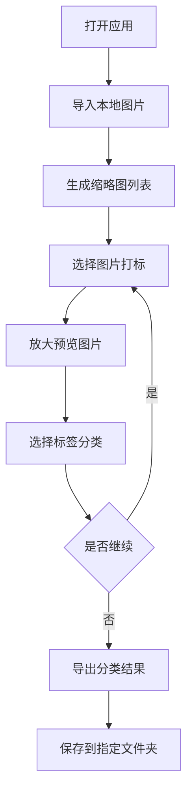

# 图片打标工具 - 产品需求文档

## 1. 产品概述

一款纯前端图片打标工具，用于对本地图片进行分类标注。支持批量处理200张左右、单张5MB的图片，通过性能优化确保流畅体验。

- 目标用户：需要对图片进行分类整理的数据标注员、设计师、摄影师
- 核心价值：本地化处理保护隐私，高效打标提升工作效率

## 2. 核心功能

### 2.1 功能模块

1. **图片管理模块**：
   - 本地图片导入（支持拖拽和文件夹选择）
   - 图片缩略图列表展示
   - 已标注/未标注状态管理

2. **打标模块**：
   - 单张图片打标界面
   - 标签分类管理（可自定义标签）
   - 快捷键支持快速标注

3. **预览模块**：
   - 图片放大预览
   - 缩放、拖拽查看细节
   - 支持鼠标滚轮缩放

4. **导出模块**：
   - 按标签分类导出图片到不同文件夹
   - 导出进度显示

### 2.2 页面详情

| 页面名称 | 模块名称 | 功能描述 |
|---------|---------|---------|
| 主页面 | 图片列表区 | 缩略图网格展示，支持分页/虚拟滚动 |
| 主页面 | 侧边栏 | 标签分类列表，统计各标签数量 |
| 主页面 | 工具栏 | 导入、导出、筛选、搜索功能 |
| 打标弹窗 | 图片预览区 | 大图展示，支持缩放和拖拽 |
| 打标弹窗 | 标签选择区 | 标签按钮组，支持快捷键 |
| 设置面板 | 标签管理 | 添加、编辑、删除自定义标签 |

## 3. 核心流程

用户使用流程：
1. 用户打开应用，点击"导入图片"选择本地图片文件夹
2. 系统加载图片并生成缩略图，展示在网格列表中
3. 用户点击单张图片进入打标模式
4. 在打标界面，用户可放大查看图片细节，选择对应标签
5. 标注完成后，自动切换到下一张未标注图片
6. 所有图片标注完成后，点击"导出"将图片按标签分类保存到不同文件夹

## 4. 用户界面设计

### 4.1 设计风格

- **主色调**：深色主题（#1a1a2e 背景，#16213e 卡片，#0f3460 强调）
- **强调色**：蓝色系（#3498db 主按钮，#2980b9 悬停）
- **字体**：系统默认字体栈，中文优先使用系统字体
- **布局**：侧边栏 + 主内容区，响应式网格布局
- **圆角**：统一 8px 圆角，现代简洁风格

### 4.2 页面设计概述

| 页面 | 模块 | UI元素 |
|-----|------|--------|
| 主页面 | 顶部栏 | 深色背景，包含logo、导入按钮、导出按钮、搜索框 |
| 主页面 | 左侧边栏 | 标签列表，显示标签名和数量，可点击筛选 |
| 主页面 | 图片网格 | 虚拟滚动网格，缩略图带悬停效果，已标注显示标签标识 |
| 打标弹窗 | 图片区 | 全屏遮罩，图片居中，支持滚轮缩放和拖拽 |
| 打标弹窗 | 底部工具栏 | 标签按钮组，上一张/下一张导航，关闭按钮 |
| 设置面板 | 标签管理 | 表单输入添加标签，列表展示可编辑删除 |

### 4.3 响应式设计

- **桌面优先**：默认1280px以上最优显示
- **自适应网格**：根据屏幕宽度自动调整列数（4-6列）
- **触摸优化**：移动端支持手势缩放和滑动

### 4.4 动画效果

- 图片加载骨架屏动画
- 缩略图悬停放大效果（scale 1.05）
- 弹窗淡入淡出过渡（200ms）
- 标签选择反馈动画
- 导出进度条动画

## 5. 性能要求

### 5.1 性能指标

- 首屏加载时间 < 2秒
- 缩略图滚动帧率 > 50fps
- 图片预览打开时间 < 300ms
- 支持同时处理200张5MB图片

### 5.2 优化策略

- 虚拟滚动：只渲染可视区域缩略图
- 图片懒加载：缩略图按需加载
- Web Worker：缩略图生成在后台线程
- IndexedDB：本地存储图片数据和标注信息
- 内存管理：及时释放不可见图片资源
