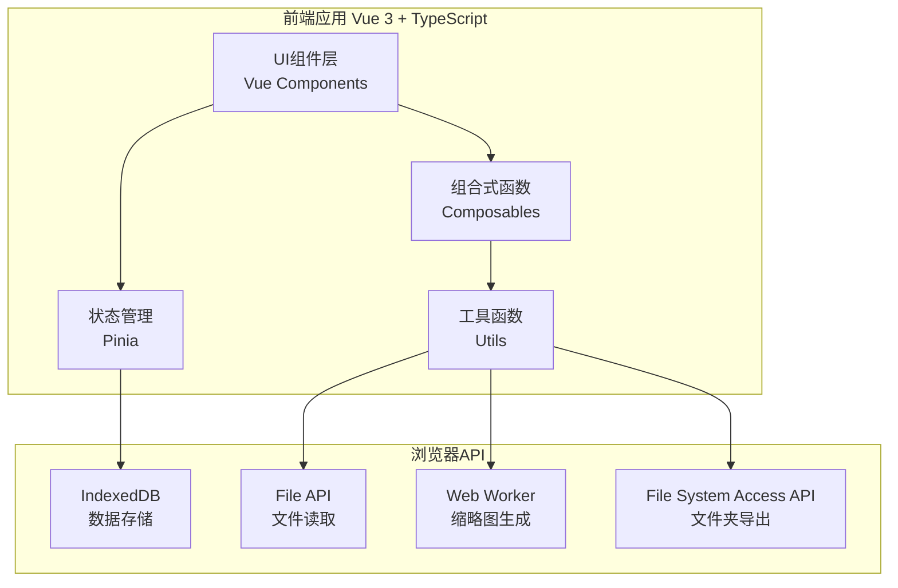
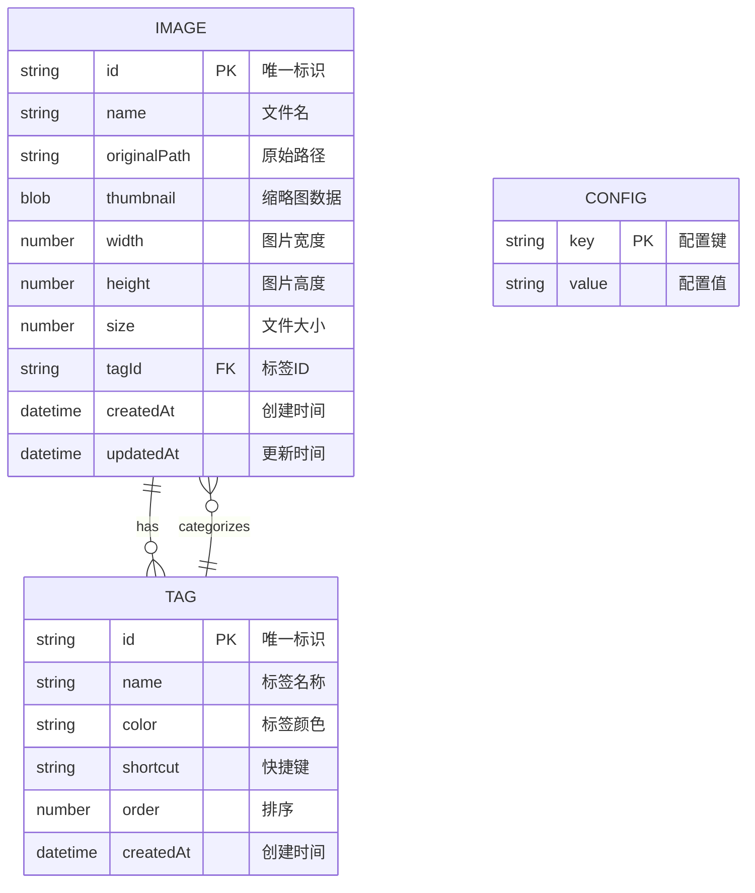

# 图片打标工具 - 技术架构文档

## 1. 架构设计



## 2. 技术栈描述

- **前端框架**: Vue 3.4 + TypeScript 5.3
- **构建工具**: Vite 5.0
- **UI样式**: Tailwind CSS 3.4
- **状态管理**: Pinia 2.1
- **图标库**: Lucide Vue
- **存储方案**: IndexedDB (via idb-keyval)
- **虚拟滚动**: vue-virtual-scroller

## 3. 路由定义

| 路由 | 用途 |
|-----|------|
| / | 主页面，图片列表和打标功能 |

**说明**: 本应用为单页面应用，所有功能在主页面通过组件切换实现，无需复杂路由。

## 4. 数据模型

### 4.1 数据模型定义



### 4.2 TypeScript 类型定义

```typescript
// 图片类型
interface ImageItem {
  id: string;
  name: string;
  originalPath: string;
  thumbnail: Blob;
  width: number;
  height: number;
  size: number;
  tagId?: string;
  createdAt: number;
  updatedAt: number;
}

// 标签类型
interface Tag {
  id: string;
  name: string;
  color: string;
  shortcut?: string;
  order: number;
  createdAt: number;
}

// 应用状态
interface AppState {
  images: ImageItem[];
  tags: Tag[];
  selectedTagId: string | null;
  searchQuery: string;
  currentImageIndex: number;
  isAnnotating: boolean;
}
```

## 5. 组件架构

```
src/
├── components/
│   ├── ImageGrid.vue          # 图片网格列表（虚拟滚动）
│   ├── ImageItem.vue          # 单张图片缩略图
│   ├── ImageViewer.vue        # 图片预览/打标弹窗
│   ├── TagSidebar.vue         # 标签侧边栏
│   ├── TagManager.vue         # 标签管理弹窗
│   ├── Toolbar.vue            # 顶部工具栏
│   ├── ExportDialog.vue       # 导出对话框
│   └── ImportDialog.vue       # 导入对话框
├── composables/
│   ├── useImages.ts           # 图片数据管理
│   ├── useTags.ts             # 标签管理
│   ├── useIndexedDB.ts        # IndexedDB操作
│   ├── useThumbnail.ts        # 缩略图生成
│   └── useExport.ts           # 导出功能
├── stores/
│   └── appStore.ts            # Pinia状态管理
├── utils/
│   ├── fileUtils.ts           # 文件处理工具
│   ├── imageUtils.ts          # 图片处理工具
│   └── constants.ts           # 常量定义
├── types/
│   └── index.ts               # TypeScript类型定义
└── App.vue                    # 根组件
```

## 6. 性能优化策略

### 6.1 虚拟滚动

- 使用 `vue-virtual-scroller` 实现图片列表虚拟滚动
- 只渲染可视区域内的图片项
- 预估每张缩略图高度，实现平滑滚动

### 6.2 缩略图生成

- 使用 Web Worker 在后台线程生成缩略图
- 缩略图尺寸限制在 200x200 以内
- 使用 JPEG 格式压缩，质量 0.7

### 6.3 懒加载

- 缩略图使用 Intersection Observer 实现懒加载
- 不可见区域的图片资源及时释放

### 6.4 存储优化

- 使用 IndexedDB 存储缩略图和元数据
- 原始图片只保存 File 引用，不存入内存
- 定期清理未使用的缓存数据

### 6.5 内存管理

- 图片预览使用 Object URL，关闭时及时 revoke
- 大图片缩放时使用 Canvas 渲染，避免 DOM 过大
- 限制同时加载的图片数量（最大20张）

## 7. 关键技术实现

### 7.1 本地文件夹导出

由于浏览器安全限制，使用 File System Access API 实现文件夹导出：

```typescript
// 请求文件夹权限
const dirHandle = await window.showDirectoryPicker();

// 创建标签子文件夹并写入文件
for (const tag of tags) {
  const tagDir = await dirHandle.getDirectoryHandle(tag.name, { create: true });
  // 复制图片到对应文件夹
}
```

### 7.2 缩略图生成 Web Worker

```typescript
// thumbnail.worker.ts
self.onmessage = async (e) => {
  const { file, maxSize } = e.data;
  const bitmap = await createImageBitmap(file);
  const canvas = new OffscreenCanvas(width, height);
  const ctx = canvas.getContext('2d');
  ctx.drawImage(bitmap, 0, 0, width, height);
  const blob = await canvas.convertToBlob({ type: 'image/jpeg', quality: 0.7 });
  self.postMessage({ blob });
};
```

### 7.3 IndexedDB 数据结构

```typescript
// 使用 idb-keyval 简化操作
const imageStore = createStore('image-labeler', 'images');
const tagStore = createStore('image-labeler', 'tags');

// 存储图片
await set(image.id, image, imageStore);

// 获取所有图片
const images = await values(imageStore);
```

## 8. 浏览器兼容性

- **Chrome/Edge**: 完全支持（推荐）
- **Firefox**: 支持（File System Access API 需开启实验性功能）
- **Safari**: 部分支持（不支持 File System Access API，导出功能受限）

**降级方案**: 对于不支持 File System Access API 的浏览器，导出功能改为打包成 ZIP 下载。
