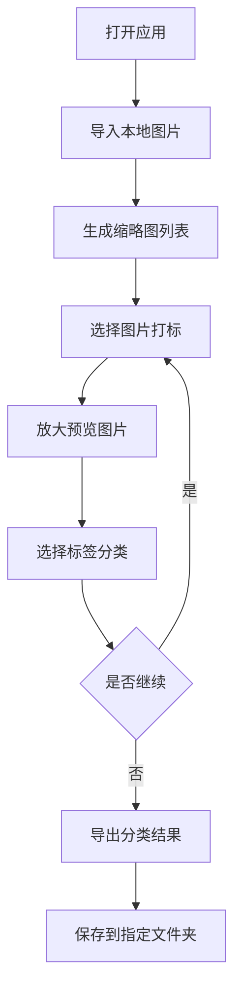
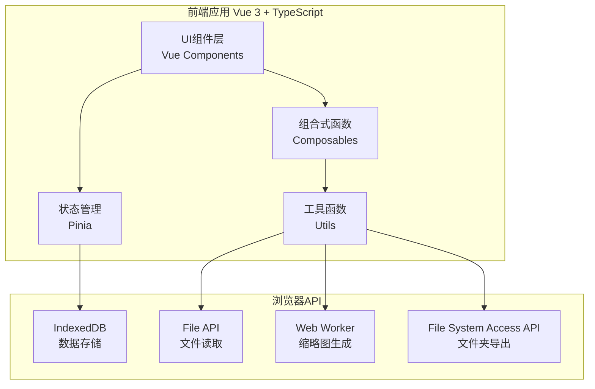
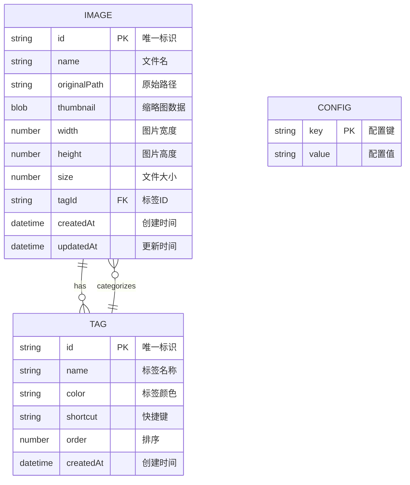

# 图片打标工具 - 产品需求文档

线上体验：[ImageTagger](https://3dtiles-1304544538.cos.ap-nanjing.myqcloud.com/index.html#/)

## 1. 产品概述

一款纯前端图片打标工具，用于对本地图片进行分类标注。支持批量处理200张左右、单张5MB的图片，通过性能优化确保流畅体验。

- 目标用户：需要对图片进行分类整理的数据标注员、设计师、摄影师
- 核心价值：本地化处理保护隐私，高效打标提升工作效率

## 2. 核心功能

### 2.1 功能模块

1. **图片管理模块**：
   - 本地图片导入（支持拖拽和文件夹选择）
   - 图片缩略图列表展示
   - 已标注/未标注状态管理

2. **打标模块**：
   - 单张图片打标界面
   - 标签分类管理（可自定义标签）
   - 快捷键支持快速标注

3. **预览模块**：
   - 图片放大预览
   - 缩放、拖拽查看细节
   - 支持鼠标滚轮缩放

4. **导出模块**：
   - 按标签分类导出图片到不同文件夹
   - 导出进度显示

### 2.2 页面详情

| 页面名称 | 模块名称 | 功能描述 |
|---------|---------|---------|
| 主页面 | 图片列表区 | 缩略图网格展示，支持分页/虚拟滚动 |
| 主页面 | 侧边栏 | 标签分类列表，统计各标签数量 |
| 主页面 | 工具栏 | 导入、导出、筛选、搜索功能 |
| 打标弹窗 | 图片预览区 | 大图展示，支持缩放和拖拽 |
| 打标弹窗 | 标签选择区 | 标签按钮组，支持快捷键 |
| 设置面板 | 标签管理 | 添加、编辑、删除自定义标签 |

## 3. 核心流程

用户使用流程：
1. 用户打开应用，点击"导入图片"选择本地图片文件夹
2. 系统加载图片并生成缩略图，展示在网格列表中
3. 用户点击单张图片进入打标模式
4. 在打标界面，用户可放大查看图片细节，选择对应标签
5. 标注完成后，自动切换到下一张未标注图片
6. 所有图片标注完成后，点击"导出"将图片按标签分类保存到不同文件夹



## 4. 用户界面设计

### 4.1 设计风格

- **主色调**：深色主题（#1a1a2e 背景，#16213e 卡片，#0f3460 强调）
- **强调色**：蓝色系（#3498db 主按钮，#2980b9 悬停）
- **字体**：系统默认字体栈，中文优先使用系统字体
- **布局**：侧边栏 + 主内容区，响应式网格布局
- **圆角**：统一 8px 圆角，现代简洁风格

### 4.2 页面设计概述

| 页面 | 模块 | UI元素 |
|-----|------|--------|
| 主页面 | 顶部栏 | 深色背景，包含logo、导入按钮、导出按钮、搜索框 |
| 主页面 | 左侧边栏 | 标签列表，显示标签名和数量，可点击筛选 |
| 主页面 | 图片网格 | 虚拟滚动网格，缩略图带悬停效果，已标注显示标签标识 |
| 打标弹窗 | 图片区 | 全屏遮罩，图片居中，支持滚轮缩放和拖拽 |
| 打标弹窗 | 底部工具栏 | 标签按钮组，上一张/下一张导航，关闭按钮 |
| 设置面板 | 标签管理 | 表单输入添加标签，列表展示可编辑删除 |

### 4.3 响应式设计

- **桌面优先**：默认1280px以上最优显示
- **自适应网格**：根据屏幕宽度自动调整列数（4-6列）
- **触摸优化**：移动端支持手势缩放和滑动

### 4.4 动画效果

- 图片加载骨架屏动画
- 缩略图悬停放大效果（scale 1.05）
- 弹窗淡入淡出过渡（200ms）
- 标签选择反馈动画
- 导出进度条动画

## 5. 性能要求

### 5.1 性能指标

- 首屏加载时间 < 2秒
- 缩略图滚动帧率 > 50fps
- 图片预览打开时间 < 300ms
- 支持同时处理200张5MB图片

### 5.2 优化策略

- 虚拟滚动：只渲染可视区域缩略图
- 图片懒加载：缩略图按需加载
- Web Worker：缩略图生成在后台线程
- IndexedDB：本地存储图片数据和标注信息
- 内存管理：及时释放不可见图片资源

# 图片打标工具 - 技术架构文档

## 1. 架构设计



## 2. 技术栈描述

- **前端框架**: Vue 3.4 + TypeScript 5.3
- **构建工具**: Vite 5.0
- **UI样式**: Tailwind CSS 3.4
- **状态管理**: Pinia 2.1
- **图标库**: Lucide Vue
- **存储方案**: IndexedDB (via idb-keyval)
- **虚拟滚动**: vue-virtual-scroller

## 3. 路由定义

| 路由 | 用途 |
|-----|------|
| / | 主页面，图片列表和打标功能 |

**说明**: 本应用为单页面应用，所有功能在主页面通过组件切换实现，无需复杂路由。

## 4. 数据模型

### 4.1 数据模型定义



### 4.2 TypeScript 类型定义

```typescript
// 图片类型
interface ImageItem {
  id: string;
  name: string;
  originalPath: string;
  thumbnail: Blob;
  width: number;
  height: number;
  size: number;
  tagId?: string;
  createdAt: number;
  updatedAt: number;
}

// 标签类型
interface Tag {
  id: string;
  name: string;
  color: string;
  shortcut?: string;
  order: number;
  createdAt: number;
}

// 应用状态
interface AppState {
  images: ImageItem[];
  tags: Tag[];
  selectedTagId: string | null;
  searchQuery: string;
  currentImageIndex: number;
  isAnnotating: boolean;
}
```

## 5. 组件架构

```
src/
├── components/
│   ├── ImageGrid.vue          # 图片网格列表（虚拟滚动）
│   ├── ImageItem.vue          # 单张图片缩略图
│   ├── ImageViewer.vue        # 图片预览/打标弹窗
│   ├── TagSidebar.vue         # 标签侧边栏
│   ├── TagManager.vue         # 标签管理弹窗
│   ├── Toolbar.vue            # 顶部工具栏
│   ├── ExportDialog.vue       # 导出对话框
│   └── ImportDialog.vue       # 导入对话框
├── composables/
│   ├── useImages.ts           # 图片数据管理
│   ├── useTags.ts             # 标签管理
│   ├── useIndexedDB.ts        # IndexedDB操作
│   ├── useThumbnail.ts        # 缩略图生成
│   └── useExport.ts           # 导出功能
├── stores/
│   └── appStore.ts            # Pinia状态管理
├── utils/
│   ├── fileUtils.ts           # 文件处理工具
│   ├── imageUtils.ts          # 图片处理工具
│   └── constants.ts           # 常量定义
├── types/
│   └── index.ts               # TypeScript类型定义
└── App.vue                    # 根组件
```

## 6. 性能优化策略

### 6.1 虚拟滚动

- 使用 `vue-virtual-scroller` 实现图片列表虚拟滚动
- 只渲染可视区域内的图片项
- 预估每张缩略图高度，实现平滑滚动

### 6.2 缩略图生成

- 使用 Web Worker 在后台线程生成缩略图
- 缩略图尺寸限制在 200x200 以内
- 使用 JPEG 格式压缩，质量 0.7

### 6.3 懒加载

- 缩略图使用 Intersection Observer 实现懒加载
- 不可见区域的图片资源及时释放

### 6.4 存储优化

- 使用 IndexedDB 存储缩略图和元数据
- 原始图片只保存 File 引用，不存入内存
- 定期清理未使用的缓存数据

### 6.5 内存管理

- 图片预览使用 Object URL，关闭时及时 revoke
- 大图片缩放时使用 Canvas 渲染，避免 DOM 过大
- 限制同时加载的图片数量（最大20张）

## 7. 关键技术实现

### 7.1 本地文件夹导出

由于浏览器安全限制，使用 File System Access API 实现文件夹导出：

```typescript
// 请求文件夹权限
const dirHandle = await window.showDirectoryPicker();

// 创建标签子文件夹并写入文件
for (const tag of tags) {
  const tagDir = await dirHandle.getDirectoryHandle(tag.name, { create: true });
  // 复制图片到对应文件夹
}
```

### 7.2 缩略图生成 Web Worker

```typescript
// thumbnail.worker.ts
self.onmessage = async (e) => {
  const { file, maxSize } = e.data;
  const bitmap = await createImageBitmap(file);
  const canvas = new OffscreenCanvas(width, height);
  const ctx = canvas.getContext('2d');
  ctx.drawImage(bitmap, 0, 0, width, height);
  const blob = await canvas.convertToBlob({ type: 'image/jpeg', quality: 0.7 });
  self.postMessage({ blob });
};
```

### 7.3 IndexedDB 数据结构

```typescript
// 使用 idb-keyval 简化操作
const imageStore = createStore('image-labeler', 'images');
const tagStore = createStore('image-labeler', 'tags');

// 存储图片
await set(image.id, image, imageStore);

// 获取所有图片
const images = await values(imageStore);
```

## 8. 浏览器兼容性

- **Chrome/Edge**: 完全支持（推荐）
- **Firefox**: 支持（File System Access API 需开启实验性功能）
- **Safari**: 部分支持（不支持 File System Access API，导出功能受限）

**降级方案**: 对于不支持 File System Access API 的浏览器，导出功能改为打包成 ZIP 下载。
